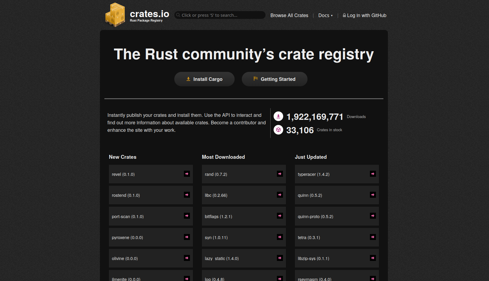
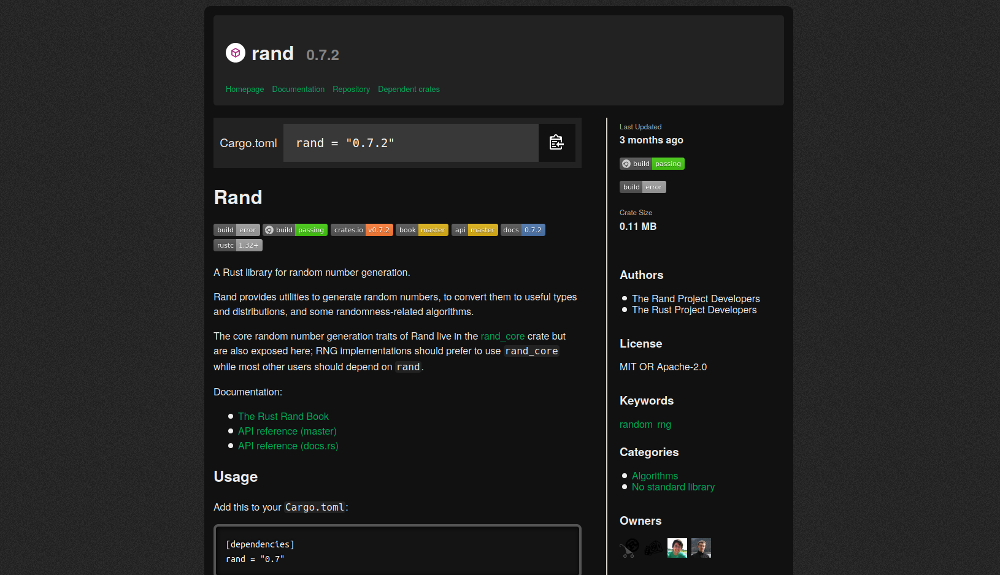

# crates-io-dark

A dark theme for [crates.io](https://crates.io/).

## Install

Install [Stylus](https://addons.mozilla.org/en-US/firefox/addon/styl-us/) and
then use Stylus to install [the crates-io-dark
usercss](./crates-io-dark.user.css).

## Screenshots

  
Screenshot of crates&#x2e;io front page

  

  
Screenshot of crates&#x2e;io/crates/rand

  

## Legal

crates-io-dark is licensed to anyone under the terms of the [Creative Commons
Attribution-ShareAlike license, version
4.0](https://creativecommons.org/licenses/by-sa/4.0/) (or any higher version,
at your option). For the relevant legal text, see
[https://creativecommons.org/licenses/by-sa/4.0/legalcode][CC BY-SA 4.0], or
the [LICENSE](./LICENSE) file for a plaintext version.

[CC BY-SA 4.0]: https://creativecommons.org/licenses/by-sa/4.0/legalcode
